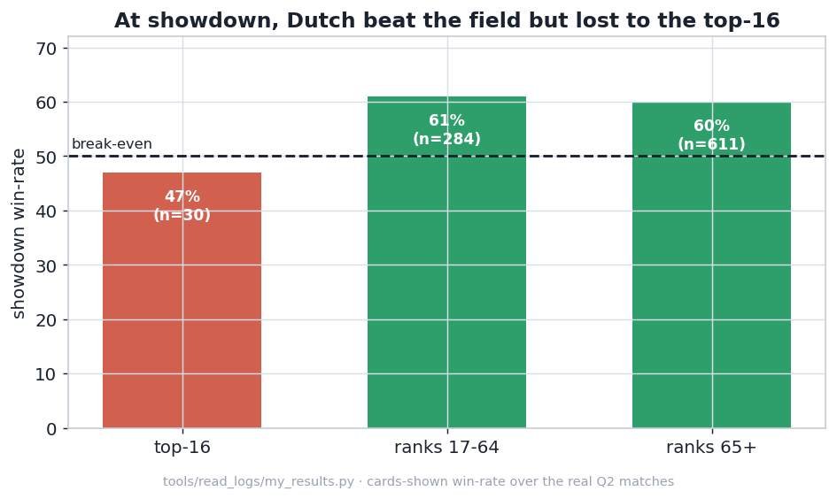
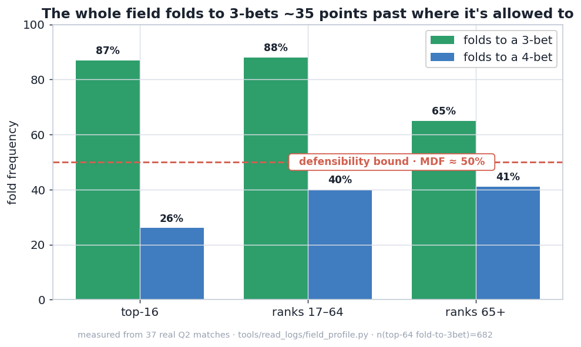
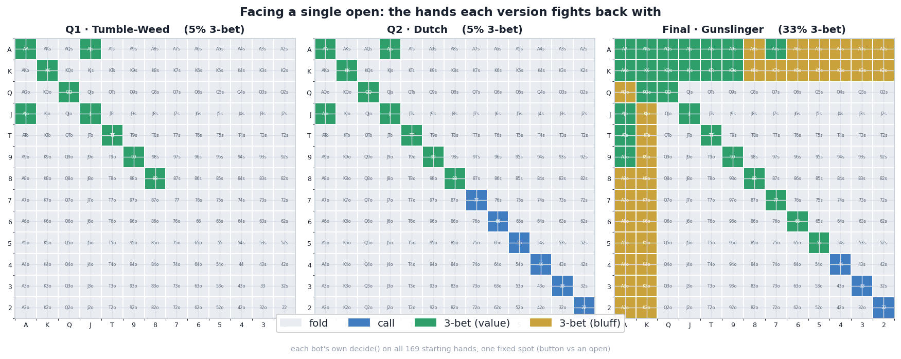
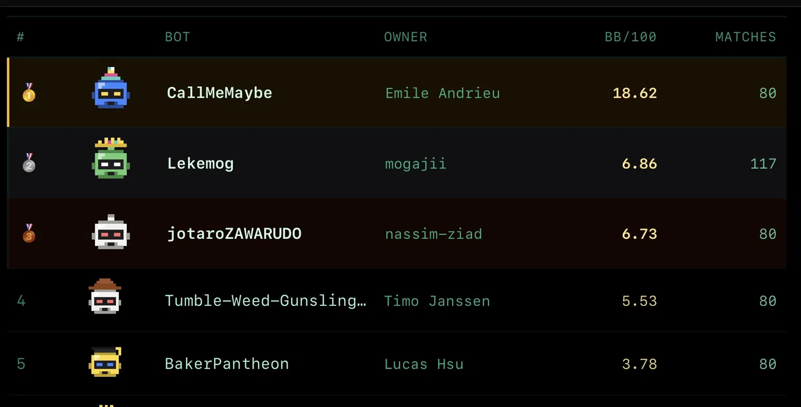
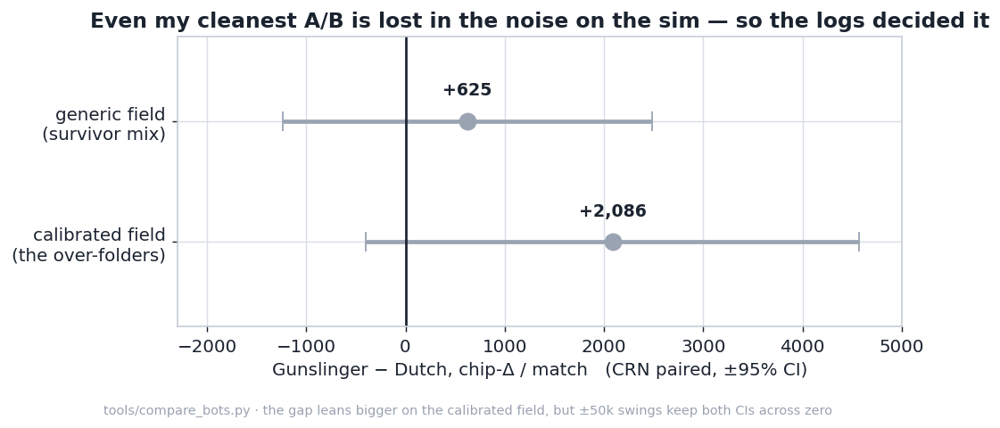

```

     __|___|__
      ('o_o')                      ______)                   __       __)
      _\~-~/_                     (, /           /)  /)     (, )  |  /          /)
     //\__/\ \ ~(_]---'~~           /     ___   (/_ //  _      | /| /  _   _  _(/
    / )O  O( .\/_)       ° o °   ) /  (_(_// (_/_) (/__(/_     |/ |/ _(/__(/_(_(_
    \ \    / \_/               °(_/                            /  |
    )/_|  |_\
   // /(\/)\ \
   /_/      \_\
  (_||      ||_)
    \| |__| |/
     | |  | |
     | |  | |
     |_|  |_|
JRO  /_\  /_\
```
<sub>Part of ASCII art by Jonathon R. Oglesbee.</sub>

A poker bot for **Fullhouse 2026**, a 6-max No-Limit Hold'em competition. It runs in stages: open
qualifiers (300+ bots, Swiss tournaments scored on cumulative chips), and the **top 64 of the second
qualifier go to a live final**. My bot went through three versions across those stages. Each one added
a layer the previous version was missing: a **base**, then a **calibration**, then an **edge**. I built
them in that order, one per stage, each driven by what the match data showed was wrong with the last.

> **Q1** → #28  ·  **Q2** → #14 (qualified)  ·  **Final** → #4

The final bot, *Gunslinger*, is those three layers stacked: a **base** (tight-aggressive poker on a
Monte-Carlo equity estimate), a **calibration** (live per-opponent reads, plus thresholds tuned for a
strong field), and an **edge** (a way to beat the good players, not just the soft ones). The three
versions below *are* the three layers, in the order I worked them out.

## 1 · Tumble-Weed: the base (Q1, #28)

The first version is the base layer: **tight-aggressive (TAG) poker** on top of a Monte-Carlo equity
estimate. TAG is the boring, proven winning style: enter pots with a disciplined set of strong-ish
hands, and when you play, bet and raise rather than call. It's the right base for two reasons. It's
**hard to exploit**: you're rarely the one holding the worst hand in the pot, so nobody traps you
cheaply. And it **punishes a soft field**, which a hackathon field is: a good slice of the 300+ entries
were thrown together against the deadline and happy to spew. So the plan was simple: play solid, don't
punt, and let weaker players pay me off.

It worked: **#28 of 300+**, inside the top 10% on cumulative chips. The TAG idea was sound; the ceiling
was two things I hadn't built yet. It was *board-blind*: it judged hands on preflop strength and never
noticed when the board had obviously made a flush or straight, so it occasionally paid off a hand it
should have folded. And it leaned on stack-based "modes" that swung it between nit and maniac
(aggression factor 7.0), adding variance for no measurable gain. A solid base, and a measured list of
what to fix next.

## 2 · Tumble-Weed-Dutch: the calibration (Q2, #14)

(Named after the one from Red Dead. He always had a plan.)

The Q1 post-mortem told me exactly what was broken. Facing a single open the bot folded **81%** of the
time, to a pot-sized bet **73%**, and at no point did it look at the board it was playing on. That is
the most exploitable profile in poker: fold that much and a competent opponent bets at you with
anything; ignore the board and you pay off every flush. So v2 wasn't a new idea, it was the first one
calibrated against everything the data flagged.

Three changes did the work:

- **Board-texture awareness.** Before betting big or stacking off, re-rank the opponent's likely hands
  on the *actual* board and back off when a flush or straight is obviously there. The coolers stopped.
- **A real opponent model**, built from scratch off the public action log: per-opponent 3-bet%,
  fold-to-bets, c-bet% and aggression, so it could stop bluffing calling stations and value-bet them
  instead.
- **Cleanup:** position-aware opening, set-mining small pairs, and the stack-based "modes" deleted,
  which pulled the aggression factor down from a manic 7.0 to a steady 2.8.

The most visible change was learning to defend: it went from folding four opens in five to closer to
two. It jumped to **#14** and qualified.

But here's the ceiling, and it's the whole reason there's a third version. Dutch was all calibration and
no pressure. It still flat-called 3-bets, never 3-bet or 4-bet light, and applied no aggression of its
own, so it could only win when an opponent handed it a mistake. The logs show exactly where that runs
out:



Against the field it won most of the showdowns it reached; against the very top it didn't. The top-16
got it to the river behind and took its money. That is what "no edge against good players" looks like in
the data, and a final is mostly those players.

## 3 · Gunslinger: the edge (the final, #4)

So I needed an edge I could create on purpose, not one that waits for the other player to slip up. I
stopped tuning my own bot and went looking in the *opponents* instead, in the logs of games I had
already played:



There's a ceiling on how often you can fold before betting at you with any two cards becomes free
money: about **50%** against a normal 3-bet (the "minimum-defense frequency"). The whole top-64 folds
**~87-88%**, about 35 points past that line, and I had been folding just as much.

So Gunslinger keeps the base and the calibration and goes on the offensive: it 3-bets far more (with
blocker-gated bluffs), 4-bets to defend its own opens instead of folding them, and continuation-bets to
keep the lead. The discipline stays: never 5-bet-bluff, never stack off light, every bluff folds to a
shove. That pressure, aimed at a field that folds too much, is where the edge comes from.



Same spot, three versions: Q1 and Dutch fold almost everything back; Gunslinger 3-bets a third of all
starting hands.

It finished **4th in the international ranking**, 5.53 BB/100 across 80 matches.



I don't have the final match logs yet, so I can't break the result down hand by hand. But the jump is
hard to read any other way.

## The field

You can't build a strong poker bot by testing against weak ones. The competition's reference bots were
thin. Beating them taught me nothing I would need against the top 64, which is the exact trap Dutch
fell into. So before I could improve the bot, I had to build something worth losing to.

`field/` is that: **35 opponents generated from parametric templates**, each a tuned style
(tightness, aggression, c-bet frequency, how it reacts to a raise). They span tiers from *weak*
(calling stations, min-raisers, naive aggressors) through *mid* (hand-chart and pot-odds bots) and
*strong* (Monte-Carlo equity bots, mixed-strategy ones) to a small *elite* tier, plus a few
deliberately *broken* bots that crash or act illegally so I know mine survives them. The tiers are
weighted to resemble the real distribution: mostly weak and mid, a thin top.

The five **over-folders** are a separate, special-purpose field: bots calibrated to the *measured*
top-64 profile from the logs (fold ~90% to a 3-bet, c-bet ~54%, sticky postflop). They exist because
the generic field, like the real practice bots, doesn't over-fold, so it can't reward the one change
that mattered. To measure that change, I had to build an opponent that would.

Then every change had to survive the `tools/` suite before I kept it: **CRN paired A/B** (both bots
play the identical decks and opponents, subtract per match, so the card luck cancels), a full
**Swiss-tournament simulation**, and **cross-validation** against a held-out slice of the field (so I
wasn't overfitting to my own opponents). Poker swings ±50,000 chips on a single hand, so without this
the numbers are meaningless:



Even my cleanest comparison, Gunslinger vs Dutch, sits inside the noise on the sim. The gap leans
bigger on the field built to the measured over-folding (about 3x the generic one), but ±50k swings
keep both confidence intervals across zero. That is the point: chip-means can't settle this on the
sim, so the deciding evidence came from the logs.

## Repo structure

```
tumbleweed/
├── tk.py                      # the test kit - one CLI for everything below  (python tk.py --help)
├── bots/
│   ├── tumbleweed_q1/         # the base       - Q1, #28
│   ├── tumbleweeddutch_v21/   # + calibration  - Q2, #14
│   └── gunslinger/            # + the edge     - the final
├── field/                     # the opponent ecology I benchmark against (35 bots, generated)
│   ├── weak/ mid/ strong/ elite/ broken/   #   archetypes, weighted to model the real field
│   ├── overfolders/           #   5 bots calibrated to the measured top-64 (fold ~90% to raises)
│   ├── generate.py            #   builds the field from templates
│   └── templates.py           #   the bot-source templates it stamps out
├── tools/
│   ├── compare_bots.py        #   CRN head-to-head A/B between two bots
│   ├── audit_bot.py           #   one bot's behavioural fingerprint (3-bet%, c-bet%, AF, busts…)
│   ├── tournament_sim.py      #   full Swiss-tournament simulation
│   ├── cross_validate.py      #   does an edge generalise to a held-out field?
│   ├── opponent_fields.py     #   the weighted field sampler (incl. the elite "survivor" mix)
│   ├── bench_vs_overfolders.py#   A/B a bot against the over-folders
│   └── read_logs/             #   mining the real match logs
│       ├── parse.py           #     the parser (segments streets, attributes chips correctly)
│       ├── field_profile.py   #     fold-to-3bet/4bet by tier  → the over-fold chart
│       ├── my_results.py      #     my real-log behaviour + results, by opponent strength
│       └── q1_leaks.py        #     the Q1 post-mortem that found the original leaks
├── figures/                   # the charts above + make_figures.py (redraws them)
└── tests/                     # pytest: safety invariants + that the exploits fire, stay disciplined
```

> The tools and the field generator are scrappy on purpose: they aren't a library. This is already the clean repo structure lol

The match harness (`fullhouse-engine`) and `eval7` are external, referenced but not included.

## Running it

Everything goes through `tk.py`, a thin CLI over the suite. `tk.py <command> --help` shows that tool's
own flags. The charts and the bot unit tests need no engine:

```bash
pip install matplotlib && python tk.py make-figures        # redraws the charts
pip install pytest eval7 && python -m pytest tests/        # 45 checks: safety + the exploits fire
```

Everything else needs the competition's harness, **fullhouse-engine**: the dealer
(`sandbox/match.py`), the rules and the reference bots. It isn't included here, and the tools import
it, so clone it and keep it as a sibling of this folder:

```bash
# 1. put this repo and the engine side by side:
#      …/your-folder/
#      ├── tumbleweed/         (this repo)
#      └── fullhouse-engine/   (the harness)
git clone <https://github.com/uzlez/fullhouse-engine.git> ../fullhouse-engine

# 2. install the shared dependencies:
pip install eval7 numpy scipy matplotlib

# 3. run the suite with the engine on the path:
export PYTHONPATH="$PWD/../fullhouse-engine"
python tk.py --help                                                    # the whole suite
python tk.py compare bots/gunslinger bots/tumbleweeddutch_v21 --crn --survivor --seeds 300
python tk.py audit   bots/gunslinger --survivor --seeds 80             # behavioural fingerprint
python tk.py tournament bots/gunslinger                                # full Swiss simulation
python tk.py profile                                                   # the field's fold rates, from the logs
```