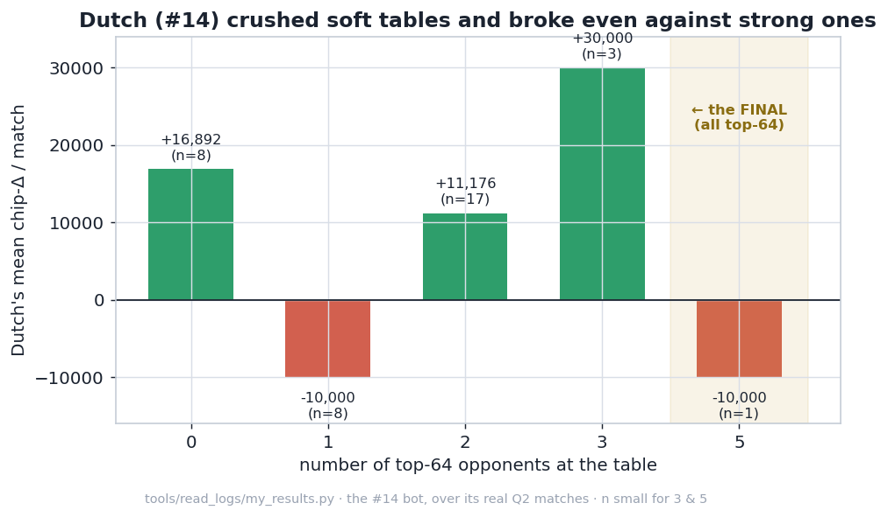
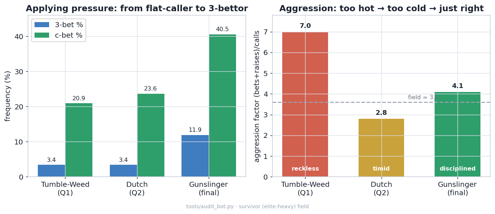

```
___
     __|___|__
      ('o_o')                      ______)                   __       __)
      _\~-~/_                     (, /           /)  /)     (, )  |  /          /)
     //\__/\ \ ~(_]---'~~           /     ___   (/_ //  _      | /| /  _   _  _(/
    / )O  O( .\/_)       ° o °   ) /  (_(_// (_/_) (/__(/_     |/ |/ _(/__(/_(_(_
    \ \    / \_/               °(_/                            /  |
    )/_|  |_\
   // /(\/)\ \
   /_/      \_\
  (_||      ||_)
    \| |__| |/
     | |  | |
     | |  | |
     |_|  |_|
JRO  /_\  /_\
```
<sub>Part of ASCII art by Jonathon R. Oglesbee.</sub>

A poker bot for **Fullhouse 2026**, a 6-max No-Limit Hold'em competition. It runs in stages: open
qualifiers (300+ bots, Swiss tournaments scored on cumulative chips), and the **top 64 of the second
qualifier go to a live final**. My bot went through three versions across those stages, and the tidy
way to put it is that each one bolted on a layer the last one was missing — a **base**, then a
**calibration**, then an **edge**. I found them strictly in that order, one version at a time, mostly
by being wrong first.

> **Q1** → #28  ·  **Q2** → #14 (qualified)  ·  **Final** → still to come

The final bot, *Gunslinger*, is those three layers stacked: a **base** (tight-aggressive poker on a
Monte-Carlo equity estimate), a **calibration** (live per-opponent reads, plus thresholds tuned for a
strong field), and an **edge** (a way to beat the good players, not just the soft ones). The three
versions below *are* the three layers, in the order I worked them out.

## 1 · Tumble-Weed — the base (Q1, #28)

The first version is the base layer: **tight-aggressive (TAG) poker** on top of a Monte-Carlo equity
estimate. TAG is the boring, proven winning style — enter pots with a disciplined set of strong-ish
hands, and when you do play, bet and raise rather than call. It's the right base for two reasons. It's
**hard to exploit**: you're rarely the one holding the worst hand in the pot, so nobody traps you
cheaply. And it's exactly the style that **punishes a soft field** — and a hackathon field *is* soft,
a good slice of the 300+ entries thrown together against the deadline and happy to spew. So the plan
was deliberately simple: play solid, don't punt, and let the loose and the careless pay me.

It worked — **#28 of 300+**, comfortably inside the top 10% with a healthy cumulative score. The TAG
idea was sound; the ceiling was two things I hadn't built yet. It was *board-blind* — it judged hands
on their preflop strength and never clocked when the board had obviously made a flush or a straight,
so now and then it paid off a cooler it should have folded. And it leaned on stack-based "modes" that
swung it between nit and maniac (aggression factor 7.0), spending variance without buying edge. A
strong base — and a clear list of what the next version should add.

## 2 · Tumble-Weed-Dutch — the calibration (Q2, #14)

(Named after the one from Red Dead. He always had a plan.)

The Q1 logs made the leaks obvious: it folded **81%** to a single open, **83%** to a 3-bet, **73%**
to a pot-sized bet, and never looked at the board. So v2 was the calibration layer. Board-texture
awareness, so it stopped stacking off into coolers. The opponent model that had been sitting there
inert, switched on — live reads of how each specific opponent plays. Position-aware opening,
set-mining, modes deleted. And the thresholds tuned against a field weighted toward strong bots
instead of the easy one.

It jumped to **#14** and qualified. Dutch had a plan, and the plan was still, fundamentally, the
weak bots:



With no top-64 opponents at the table it made **+16,892** a match; at tables full of them it broke
even. Calibrated, board-aware, disciplined — and quietly dependent on there being weak bots in the
room. The final does not invite the weak bots.

## 3 · Gunslinger — the edge (the final)

Top-64 only, so the farm was closed. A base and a calibration get you a competent bot; they don't get
you an edge against good players. For that I stopped tuning my own bot and read the *opponents* — out
of the real logs of games I'd already played:


There's a ceiling on how often you can fold before betting at you with any two cards becomes free
money — about **50%** against a normal 3-bet (the "minimum-defense frequency"). The whole top-64 folds
**~87–88%**: thirty-five points past the line, uniformly. And I'd been folding just as much.

So Gunslinger keeps the base and the calibration and adds a possible edge: 3-bet far more (with blocker-gated
bluffs), 4-bet to defend my own opens instead of folding them, and continuation-bet to keep the lead
instead of getting run over — while never 5-bet-bluffing, never stacking off light, and folding every
bluff to a shove.



Reckless, then timid, then disciplined. It took three goes to land in the middle.

**The final hasn't been played yet**, so there's no result to put here. This repo is a work in
progress until it has.

## The field

You can't build a strong poker bot by testing against weak ones. The competition's reference bots were
thin — beating them taught me nothing I'd need against the top 64 (it's the exact trap Dutch fell
into). So before I could improve the bot, I had to build something worth losing to.

`field/` is that: **35 opponents generated from parametric templates** — each a dialled-in style
(tightness, aggression, c-bet frequency, how it reacts to a raise) — spread across tiers from *weak*
(calling stations, min-raisers, naive aggressors) through *mid* (hand-chart and pot-odds bots) and
*strong* (Monte-Carlo equity bots, mixed-strategy ones) to a small *elite* tier, plus a few
deliberately *broken* bots that crash or act illegally, to make sure mine survives them. The tiers are
weighted to resemble the real distribution: mostly weak and mid, a thin top.

The five **over-folders** are a separate, special-purpose field: bots calibrated to the *measured*
top-64 profile from the logs (fold ~90% to a 3-bet, c-bet ~54%, sticky postflop). They exist because
the generic field — like the real practice bots — doesn't over-fold, so it structurally can't reward
the one change that mattered. To measure that change, I had to build an opponent that would.

Then every change ran the gauntlet in `tools/`: **CRN paired A/B** (both bots play the identical decks
and opponents, subtract per match, so the card luck cancels), a full **Swiss-tournament simulation**,
and **cross-validation** against a held-out slice of the field (so I was not
overfitting to my own opponents). Poker swings ±50,000 chips on a single hand, so without this the
numbers are meaningless:


Even my cleanest comparison — Gunslinger vs Dutch — sits inside the noise on the sim. The gap leans
bigger on the field built to the measured over-folding (about 3× the generic one), but ±50k swings
keep both confidence intervals across zero. That's the point: chip-means can't settle this on the sim,
so the deciding evidence came from the logs. I also believed the noise twice and caught it — a
"+4,007, p=0.001" that evaporated at higher sample sizes, and an "88% fold-to-4-bet" I'd assumed
instead of measured (it's ~40%; the bluff that leaned on it got cut). Both are still documented;
hiding them would read worse.

## How it works

Three things in one `decide(state)` — the same three layers as the story:

- **base** — `eval7` + Monte-Carlo equity against an estimated opponent range, with a board-texture
  pass that won't stack off a fragile hand when a flush/straight/boat is obviously out there.
- **calibration** — a per-opponent model (3-bet% · fold-to-3bet/4bet · c-bet% · aggression ·
  tightness) rebuilt each match from the public action log, sample-gated so it doesn't react to three
  data points. It reads *behaviour*, never a hardcoded opponent.
- **possible edge** — the disciplined preflop pressure from 3).

## Repo structure

```
tumbleweed/
├── tk.py                      # the test kit — one CLI for everything below  (python tk.py --help)
├── bots/
│   ├── tumbleweed_q1/         # the base       — Q1, #28
│   ├── tumbleweeddutch_v21/   # + calibration  — Q2, #14
│   └── gunslinger/            # + the edge     — the final
├── field/                     # the opponent ecology I benchmark against (35 bots, generated)
│   ├── weak/ mid/ strong/ elite/ broken/   #   archetypes, weighted to model the real field
│   ├── overfolders/           #   5 bots calibrated to the measured top-64 (fold ~90% to raises)
│   ├── generate.py            #   builds the field from templates
│   └── templates.py           #   the bot-source templates it stamps out
├── tools/
│   ├── compare_bots.py        #   CRN head-to-head A/B between two bots
│   ├── audit_bot.py           #   one bot's behavioural fingerprint (3-bet%, c-bet%, AF, busts…)
│   ├── tournament_sim.py      #   full Swiss-tournament simulation
│   ├── cross_validate.py      #   does an edge generalise to a held-out field?
│   ├── opponent_fields.py     #   the weighted field sampler (incl. the elite "survivor" mix)
│   ├── bench_vs_overfolders.py#   A/B a bot against the over-folders
│   └── read_logs/             #   mining the real match logs
│       ├── parse.py           #     the parser (segments streets, attributes chips correctly)
│       ├── field_profile.py   #     fold-to-3bet/4bet by tier  → the over-fold chart
│       ├── my_results.py      #     my chip-Δ by #top-64 opponents  → the chips chart
│       └── q1_leaks.py        #     the Q1 post-mortem that found the original leaks
└── figures/                   # the four charts above + make_figures.py (redraws them)
```

> The tools and the field generator are scrappy on purpose: I directed them, and claude wrote most of the
> code, and each one answers a single question. They work; they aren't a library. This is already the clean repo structure lol

The match harness (`fullhouse-engine`) and `eval7` are external — referenced,
not included.

## Running it

Everything goes through `tk.py`, a thin CLI over the suite — `tk.py <command> --help` shows that
tool's own flags. The charts are the only fully standalone part:

```bash
pip install matplotlib && python tk.py make-figures        # redraws all four charts
```

Everything else needs the competition's harness, **fullhouse-engine** — the dealer
(`sandbox/match.py`), the rules and the reference bots. It isn't included here, and the tools import
it, so clone it and keep it as a sibling of this folder:

```bash
# 1. put this repo and the engine side by side:
#      …/your-folder/
#      ├── tumbleweed/         (this repo)
#      └── fullhouse-engine/   (the harness)
git clone <fullhouse-engine-repo-url> ../fullhouse-engine

# 2. install the shared dependencies:
pip install eval7 numpy scipy matplotlib

# 3. run the suite with the engine on the path:
export PYTHONPATH="$PWD/../fullhouse-engine"
python tk.py --help                                                    # the whole suite
python tk.py compare bots/gunslinger bots/tumbleweeddutch_v21 --crn --survivor --seeds 300
python tk.py audit   bots/gunslinger --survivor --seeds 80             # behavioural fingerprint
python tk.py tournament bots/gunslinger                                # full Swiss simulation
python tk.py profile                                                   # the field's fold rates, from the logs
```


## The Ugly

- The edge holds *as long as the field keeps over-folding*. If they tighten, Gunslinger is at parity
  with Dutch, not behind — but the gap shrinks. Finger crossed!!!
- The strongest evidence is the log measurement, not the sim (too noisy). The over-folder field
  narrows the gap but is only as good as its calibration — which is exactly what bit me on the 88%.
- Still a little passive postflop as the caller; the next things to try are float-and-attack lines and
  fold-to-4bet tracking.
